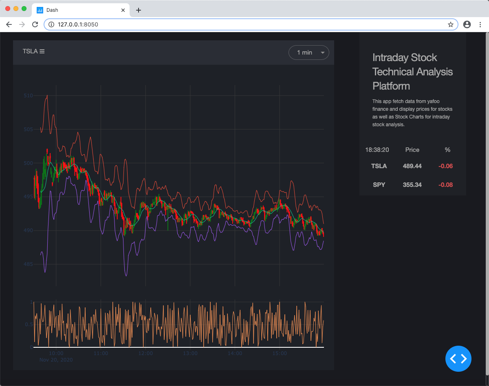

# IntradayStockTechnicalAnalysis
This app is modified from Dash-Web-Trader for intraday stock technical analysis.
The goal is to test indicators and strategy for day traders. The app will fetch data from yahoo finance every 2 seconds and display plots.

## How to run this app


Create and activate a new virtual environment (recommended) by running
the following:

On Windows

```
virtualenv venv 
\venv\scripts\activate
```

Or if using linux

```bash
python3 -m venv myvenv
source myvenv/bin/activate
```
Run the app:

```
python app.py
```
You can run the app on your browser at http://127.0.0.1:8050

## Screenshots



## Resources

To learn more about Dash, please visit [documentation](https://plot.ly/dash).